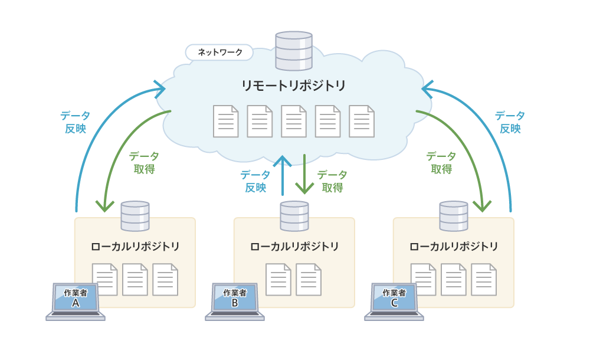
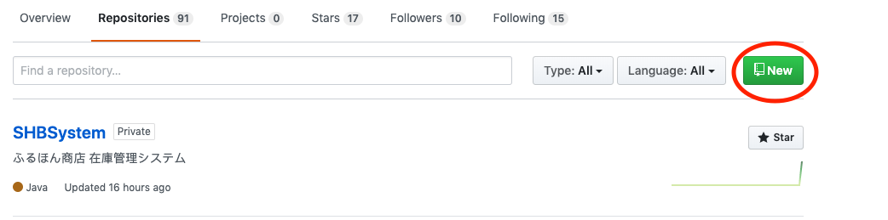
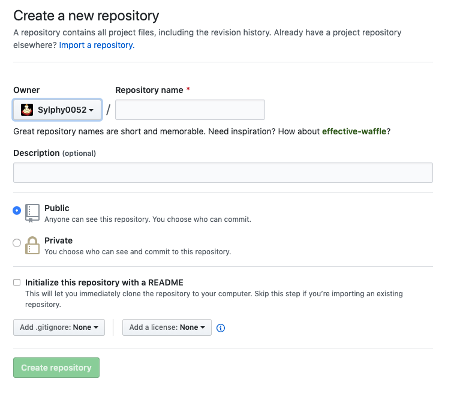

# GitHubとは
GitHub: ソースコード管理システム

主な機能
- ソースコードの閲覧
- 簡単なバグ管理機能
- SNS
- など

## ローカルリポジトリとリモートリポジトリ
リポジトリ: ファイルやディレクトリの状態を保存する場所．
変更履歴を管理したいファイルやディレクトリをリポジトリの管理下に置くことで，そのディレクトリ内のファイルなどの変更履歴を記録できる

リポジトリは自分のPCにある**ローカルリポジトリ**とサーバなどのネットワーク上にある**リモートリポジトリ**が存在する．
開発社はローカルリポジトリで作業を行い，その作業内容をリモートリポジトリへプッシュする．

## コミットとプッシュ
- コミット(commit): ファイルの追加や変更の履歴をローカルリポジトリに保存すること
- プッシュ(push): ファイルの追加や変更の履歴をリモートリポジトリにアップロードするための操作

## ブランチ
ソフトウェアの開発では，現在リリースしているバージョンのメンテナンスをしながら新たな機能追加やバグ修正を行うことがある．
このように，並行すて行われる複数のバージョン管理を行うためにGitにはブランチ(branch)という機能がある．

ブランチは履歴の流れを分岐して記録していくものである．
分岐したブランチは他のブランチの影響を受けないため，同じリポジトリ内でそれぞれの開発を行っていくことができる．

## GitHubの流れ

1. GitHubでリポジトリを作成する

---

- Owner: リポジトリの管理者
- Repository name: リポジトリの名前
- Description(optional): そのリポジトリの名前
- Public/Private: そのリポジトリを公開する(Public)か公開しない(Private)か
- Initialize this repository with a README: [README](#readme)をトップページに追加するかどうか
- Add .gitignore: gitignoreのデフォルト設定
- Add a license: ライセンスを追加するかどうか

 
 
 
 
 
 
 
 
 
 
 
 
 
 
 
 
 
 
 
 
 
 
 
 
 
 
 
 
 
 

## 参考
- [今さら聞けない！GitHubの使い方【超初心者向け】](https://techacademy.jp/magazine/6235)
