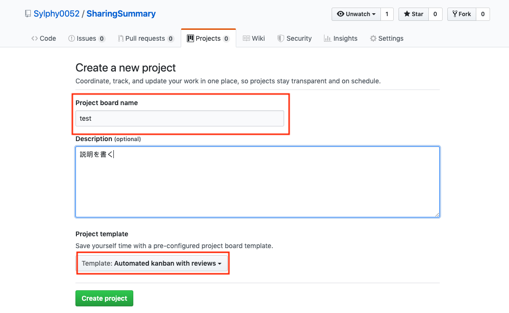
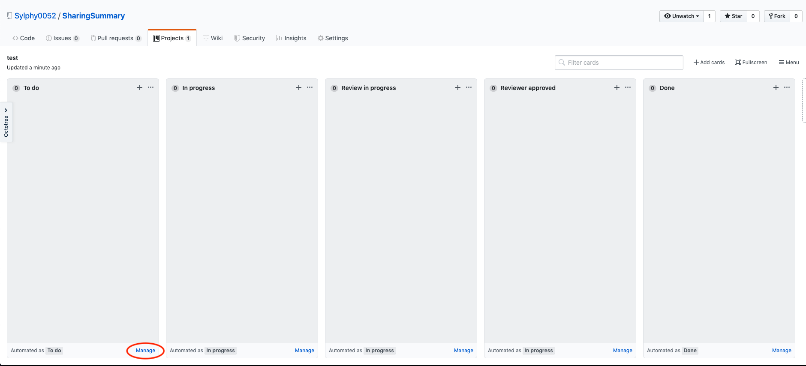
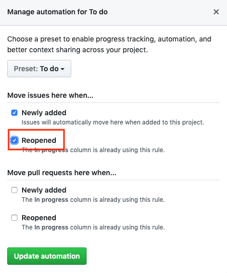
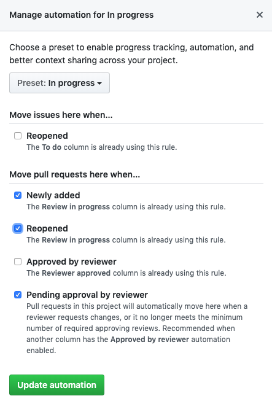
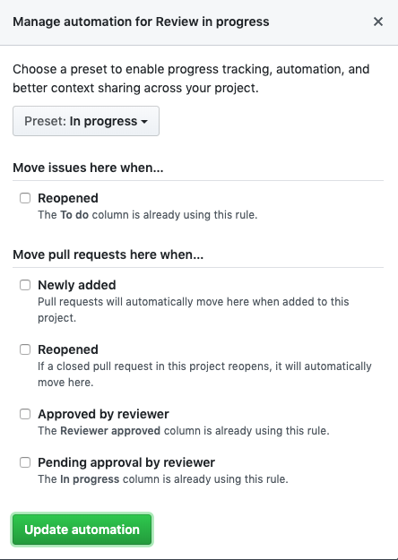
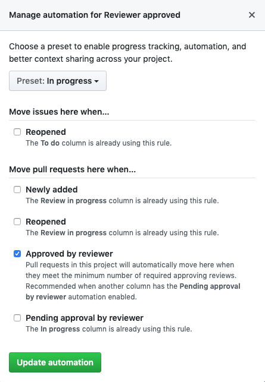
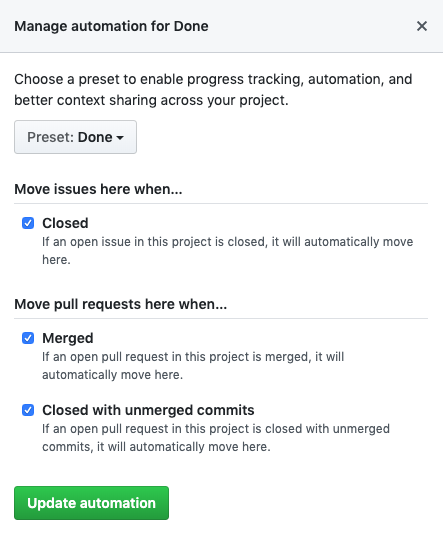
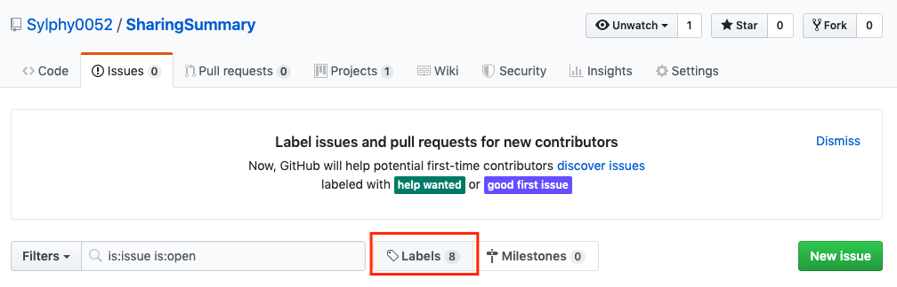
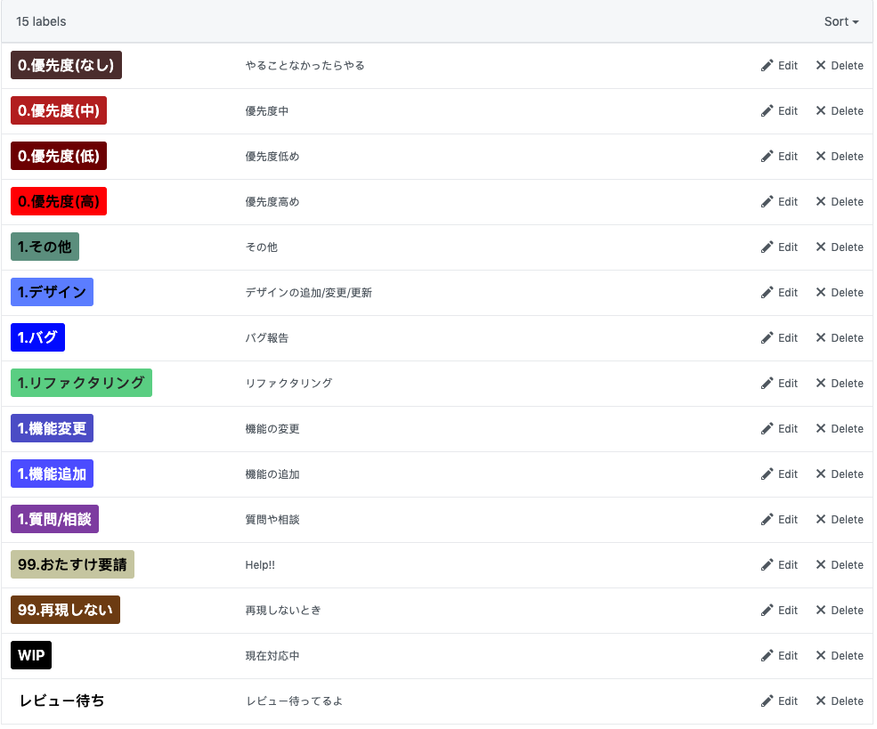
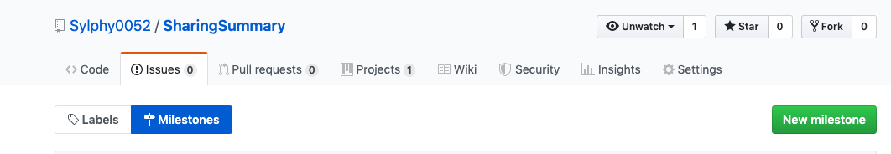

# プロジェクト管理
## タブ
GitHubのリポジトリのメイン画面
- Code: ソースコードが見れる
- Issues
- Pull requests
- Projects

## リポジトリの初期設定
1. リポジトリを作る
2. Settingタブ→Collaboratorsタブ→共同開発者を追加
3. Projectsタブ→Create a project→Project board name，(Description),を書いて，Project templateをAutomated kanban with reviewsに設定する



機能毎に分けるか，日付ごとに分けるかなど工夫することでToDoを見やすくできる

4. To doカラムのManageの設定



---



5. In progressの設定



6. Review in progressの設定



7. Reviewer approvedの設定



8. Doneの設定



9. IssuesタブのLabelsを追加する



ラベルはIssueの状態を表すことができ，複数つけることができる．

- 0.優先度(高)
- 0.優先度(中)
- 0.優先度(低)
- 0.優先度(なし)
- 1.バグ
- 1.機能追加
- 1.機能変更
- 1.デザイン
- 1.質問/相談
- 1.リファクタリング
- 1.その他
- 99.再現しない
- 99.おたすけ要請
- WIP
- レビュー待ち

0: 優先度の設定．高から順に対応していく

1: Issueの種類

99:おたすけ
- `99.再現しない`はバグ報告があったがその現象にならないとき
- `99.おたすけ要請`は自分では解決できないとき

その他: 現在の状況
- `WIP(Work In Progress)`は現在対応中のラベル
- `レビュー待ち`はプルリクエストを送った後



10. ラベルの1に合わせてIssueのテンプレートを作る

例: バグのテンプレート - `.github/ISSUE_TEMPLATE/BUG.md`
```
---
name: バグ報告
about: バグの報告
title: "[BUG]: " ←プレフィックスを付けると分かりやすい
labels: バグ報告 ←設定したラベルと同じもの
assignees: ''

---

#### バグの説明

#### 再現方法

1.
2.
3.

#### 期待される結果

-

#### 実際の結果

-

#### 追加情報(詳細/スクショ)

- 
-

```

11. プルリクエストのテンプレートを作る

例) `.github/PULL_REQUEST_TEMPLATE.md`
```
#### 対応issue

close/fix/resolve #<issue番号>

#### 実装内容

何を実装したのか

#### 備考

注意点など

```

12. マイルストーンの追加



1日ごと，もしくは機能や時間(13:00や午前中など)で細かく分ける

13. `develop`ブランチを作る(統合テスト用)．masterブランチは最後以外触れない

14. もし共有したいことがあればWikiに記入

## 参考
- [Qiita: 新入社員におくるGitHubでのプロジェクト管理の初歩](https://qiita.com/gumimin/items/63dcb36d4730213bd63a)
