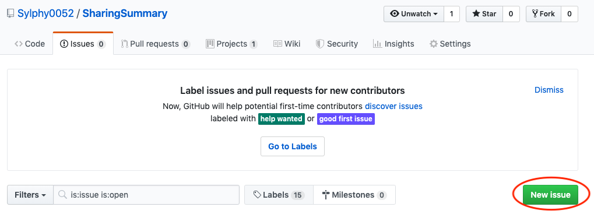
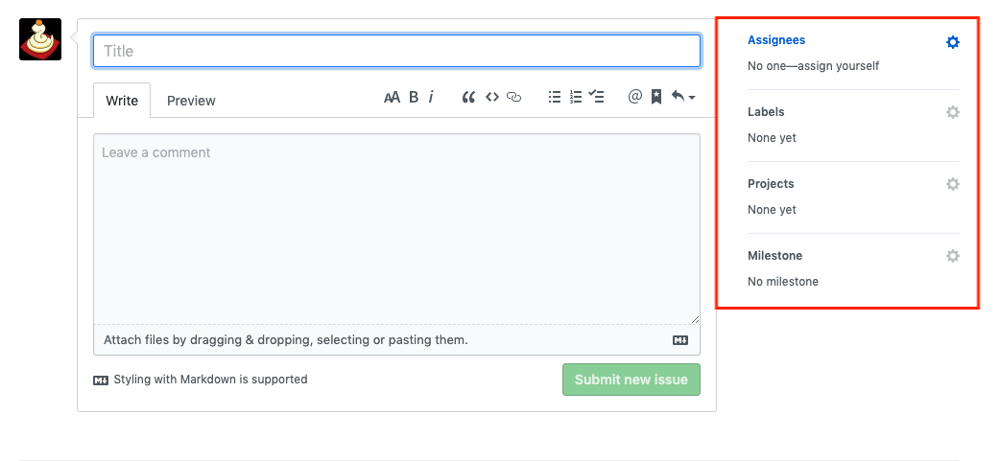
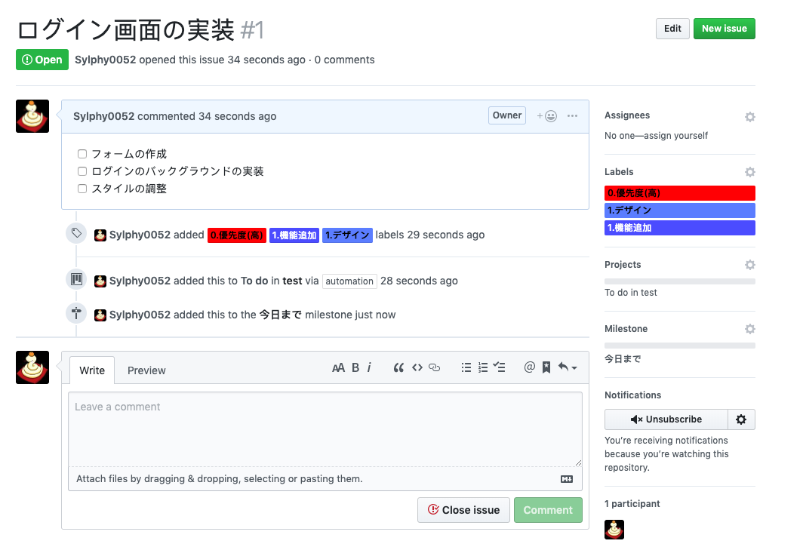
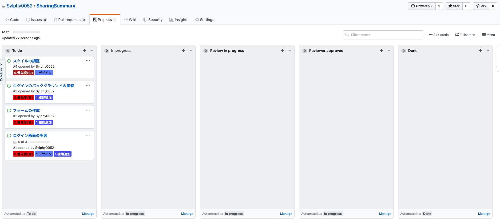

# プロジェクトの進め方
- WBSなどのエクセルファイルはGoogleスプレッドシートのリンクを`README.md`やWikiに書いて共有する→GoogleスプレッドシートやGoogleスライドは複数人同時に編集可能
- 基本はIssueを追加していく





- Title: Issueの概要
- Comment: Issueの細かい内容
- Assignees: 担当者
- Labels: 作ったラベルを選択する．少なくとも0と1は必ずつける
- Projects: どのプロジェクトボードで管理するかの紐付け
- Milestone: 作ったマイルストーンを選択する

CommentにはMarkdown記法が使える．書き方は[こちら](https://github.com/adam-p/markdown-here/wiki/Markdown-Cheatsheet)を参照．

Assigneesは基本空にしておいて，担当者が決まったら追加する．



Issueを作るとProjectsのボードに自動で追加される



Issueは大枠を作ってチェックボックスで細かいTo Doを作ると良い．
その細かいTo Doで更にIssueを書くと細分化できる．

Issueとプルリクエストの連携
```
{キーワード} #{イッシュー番号}

# 例
fix #1
```
これをプルリクエストに追加すると，Issueを自動で閉じてくれる

キーワード
- close
- fix
- resolve

## 開発者フロー
1. Issueを作る(PMがやってもよい)
2. Projectsのプロジェクトボードの`To do`から`In progress`に移動させる
2. Branchを作る(基本的には`issue001`などissueでブランチ名をつける)
3. 空コミットする
4. 途中でタイトルに`[WIP]`をつけてプルリクエストを出す(ToDoリストや終わっていないことを書いておくと良い)
5. レビュアをアサインする(基本PMなど全体がわかっている人)
6. コードを書く
7. 終わったら`[WIP]`を外し，レビュアにメンション(`@ユーザ名`)する
8. Projectsのプロジェクトボードの`In progress`から`Review in progress`に移動させる
8. レビューを受けコードを修正する
9. うまくいったらマージしてもらう
10. 1に戻る

## PMフロー
1. Issueを作る
2. Issueをアサインする
3. 開発社から`[WIP]`がついていないプルリクエストまたはメンションされたら対応する
4. プルリクエストに対してはレビューを書く
5. そのブランチをローカルに持ってきてテストする
6. 問題がなかった場合，マージする
