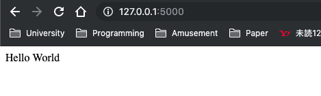

# Flaskのインストール方法

## 手順
1. WindowsはAnaconda Promptから，Macはターミナルからインストールする

`pip install Flask`

2. 終わりー

## 起動してみる

作業用フォルダ/ディレクトリを作成する．

```shell
# フォルダ/ディレクトリの作成
mkdir flask_test
# フォルダ/ディレクトリの移動
cd flask_test
```

そこにコードを書いて実行する．

```shell
# ファイルの追加
touch hello.py
# ファイルを編集する(Atomとかがいいかも)
# 実行
python hello.py
```

`hello.py`

```python
from flask import Flask
app = Flask(__name__)

@app.route('/')
def hello():
    name = "Hello World"
    return name

if __name__ == "__main__":
    app.run(debug=True)
```

実行したら[http://localhost:5000/](http://localhost:5000/)にアクセスしてみる．



```shell
~/G/c/FlaskTutorial ❯❯❯ mkdir sylphy0052
~/G/c/FlaskTutorial ❯❯❯ cd sylphy0052
~/G/c/F/sylphy0052 ❯❯❯ touch hello.py
~/G/c/F/sylphy0052 ❯❯❯ atom .
~/G/c/F/sylphy0052 ❯❯❯ python hello.py
 * Serving Flask app "hello" (lazy loading)
 * Environment: production
   WARNING: Do not use the development server in a production environment.
   Use a production WSGI server instead.
 * Debug mode: on
 * Running on http://127.0.0.1:5000/ (Press CTRL+C to quit)
 * Restarting with stat
 * Debugger is active!
 * Debugger PIN: 103-490-194
```
